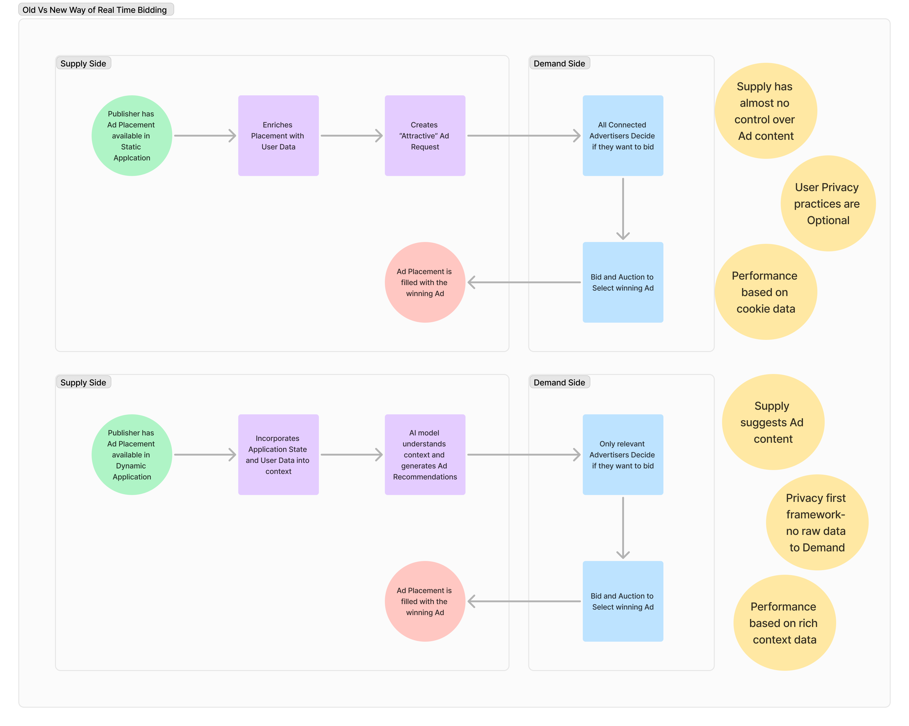

<h3 align="center">
  
  
</h3>

# ADS4GPTs - Open Standards

**Bringing Ad Standards into the AI Era**  

**ADS4GPTs - Open Standards** is an open-source initiative dedicated to elevating the existing Advertising standards for AI Native Advertising. Our goal is to define specifications, protocols, and conceptual frameworks that empower AI applications to seamlessly interact with advertising ecosystems while adhering to industry best practices.

---

## 🚀 Mission

**ADS4GPTs - Open Standards**  provides a robust foundation for AI-driven advertising by:

- Establishing AI-focused Ad specifications.
- Defining protocols to ensure seamless AI-advertiser interactions.
- Outlining conceptual frameworks for ad delivery, measurement, and compliance in AI environments.

### Show Your Support

If you find our ADS4GPTs project helpful, please give it a star ⭐️

Standards Repository: 

Integration Repository: 

---

## 🧠 Philosophy

The digital media landscape is shifting from static content to AI-driven interactions through chatbots, autonomous agents, and dynamic applications, requiring a reevaluation of traditional advertising protocols that rely on user tracking and invasive data collection. At ADS4GPTs, the focus is on transforming the advertising landscape alongside these shifts, moving from static digital content to AI applications, chatbots, and agents. Traditional protocols no longer meet the needs of such autonomous systems, so this project builds on permissioned marketing and takes it further by integrating advanced AI technologies with established standards.

Not only AI Native applications can benefit from the ADS4GPTs architecture. Even traditional media and digital Ad placements can adopt our philosophy and approach.

ADS4GPTs introduces a paradigm shift in digital advertising by:

- Leveraging AI to understand user intent rather than tracking behavior
- Implementing permissioned marketing principles at the protocol level
- Enabling contextual ad matching without compromising privacy
- Creating standardized interfaces between AI systems and ad networks

### Core Architectural Evolution

Below is a visual representation of the evolution from traditional advertising architectures to our new AI-driven approach:

- **Old Architecture**: Supply side provides an impression request with as much invasive information that it seems highly valuable from the demand side and bid high.
- **New Architecture**: Supply side understands the needs of the user and requests the relevant Ads from the available advertisers. 

With GPT Ads and AI agents becoming the new interface for interacting with the Internet, the existing AdTech ecosystem is poised for significant transformation. Here's how we envision the transformation:

### Supply-Side Platforms (SSPs)
- Evolve into AI integration hubs
- Develop proprietary Ad Agents and offer them as a Service
- Focus on daily operational support
- Aggregate intelligence from Ad Agent interactions
- Minimum bid optimization

### Demand-Side Platforms (DSPs) 
- Optimize bidding mechanisms for AI environments
- Provide real-time performance analytics
- Bidding and budget optimization

### Ad Exchanges 
- Establish trust frameworks for AI-driven exchanges
- Support seamless advertiser-AI communication

In the following architectural diagram you see a version of this vision:

---

## 📂 Repository Structure

The repository is organized into the following key directories:

- **`Drafts/`** – All new contributions should be placed here for review and iteration.
- **`Ad Specifications/`** – Specifications for Ad types and Placements.
- **`Communication Protocols/`** – Protocols for AI applications, SSPs, DSPs and Advertisers.
- **`Prompt Guiding Principles`** - Integration Prompt Guidelines

---

## 📖 Specifications, Standards & Protocols

Our focus areas include, but are not limited to:

- **Communication Protocols** – Seamless interaction of AI agents with ad servers and exchanges.
- **Permissioned Advertising** – Ensuring that AI ads are served only to users who have given explicit consent and are actively requesting Ads.
- **Privacy & Compliance** – Aligning with GDPR, CCPA, and ethical AI guidelines.
- **Anti-Fraud Principles** - Creating frameworks to keep AI Ads away from fraudulent activities.
- **Brand Safety Guardrails** - Ensuring that AI Ads are displayed in environments that are safe for brands and free from harmful content while avoiding misrepresentation.
- **Performance Measurement** – Metrics and reporting frameworks for AI-driven ads.
- **Contextual Ad Delivery** – Enabling AI agents to understand and serve contextual ads effectively.
- **Programmatic AI Buying** – Standardized methods for AI participation in real-time bidding (RTB).

---

## 🤝 Contributing

We welcome contributions from the community to help shape the future of AI advertising standards. Please follow these guidelines to contribute:

1. **Fork the repository** and create a new branch for your changes.
2. **Work only within the `Draft/` folder**, either by updating existing files or adding new ones.
3. **Submit a pull request (PR)** with a clear description of your proposed changes.
4. **Engage with the community** to refine and discuss your contribution.
5. Once reviewed and approved, drafts may be moved to the according folder.

**Branch Naming Convention:**  
Use descriptive names for your branches, such as:  
`feature/ai-ad-bidding`, `fix/spec-typo`, `update/contextual-ads`.

---

## 🛡️ Licensing

This repository is licensed under the **Attribution-ShareAlike 4.0 International**. By contributing to this repository, you agree to license your contributions under the same license.

---

## 📧 Contact

For questions, suggestions, or collaborations, please reach out via:

- GitHub Issues
- Community: [Discord](https://discord.gg/Q8BVQ3wZnc)
- Follow us on [Twitter](https://twitter.com/ads4gpts) for updates.

---

## 🌟 Join the Community

Be part of the movement to revolutionize AI-driven advertising! 

- 🌐 [ADS4GPTs Official Website](https://ads4gpts.com)
- 🛠️ [ADS4GPTs Open-Source Projects](https://github.com/ADS4GPTs)

## 📚 We Are Building on the Shoulders of Giants

Our work is inspired and supported by the foundational efforts of industry leaders and standards organizations. We acknowledge and build upon the following:

- 📖 [IAB Standards](https://www.iab.com/)
- 📖 [W3C Standards](https://www.w3.org/standards/)
- 📖 [GDPR Guidelines](https://gdpr.eu/)
- 📖 [CCPA Regulations](https://oag.ca.gov/privacy/ccpa)
- 📖 [Ethical AI Guidelines](https://www.un.org/en/ethics/ethical-ai)
